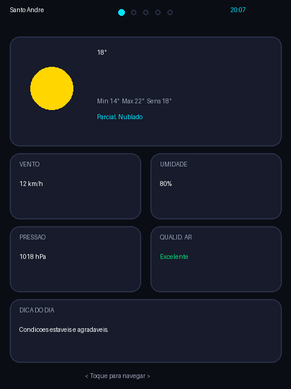

# 🌦️ Atmos BR — Estação Meteorológica para ESP32 CYD

[](https://github.com/erbernardino/cyd-atmos-station-br/actions/workflows/build.yml)
[](LICENSE)
[](https://platformio.org/)

> Projeto Open-Source completo em C++ para a placa **ESP32 "Cheap Yellow Display" (CYD / ESP32-2432S028)**, com interface moderna, previsão meteorológica via **Open-Meteo**, relógio NTP e navegação touch em **Português do Brasil**.



---

## 📸 Funcionalidades

- **100% em Português do Brasil:** Dias da semana, condições climáticas, avisos de saúde e menus traduzidos.
- **Previsão em Tempo Real (Open-Meteo):** Sem chaves de API pagas ou cadastro.
- **Telas Informativas:**
  1. **Clima Atual:** Temperatura, Sensação Térmica, Mín/Máx, Vento, Umidade, Pressão, Qualidade do Ar e Dica do Dia.
  2. **Previsão Horária:** Detalhes das próximas horas com probabilidade de precipitação.
  3. **Previsão de 7 Dias:** Semana completa com temperaturas máximas e mínimas.
  4. **Qualidade do Ar:** Níveis de AQI Europeu, PM2.5, PM10, Ozônio e Índice UV.
  5. **Status do Sistema:** Endereço IP local, cidade configurada, seletor de tema e versão do firmware.
- **Dois Temas Visuais:** Swiss Minimalist (Dieter Rams) e Pixel Art (Retro), trocáveis por toque na tela ou pelo portal web. Veja [[docs/index|documentação de temas]].
- **LED RGB por Condição Climática:** A cor do LED reflete o tempo atual (ligável/desligável).
- **Conexão Wi-Fi Multi-Rede com Portal Cativo:** Configure sua rede e senha pelo celular sem precisar recompilar o código; reconecta automaticamente entre redes memorizadas.
- **Modo Noturno (Eco Mode):** Redução automática do brilho da tela durante a noite.
- **Compatibilidade:** Modelos CYD 2.8" Resistivo ou Capacitivo com case 3D (ex: case Atmos do MakerWorld).

---

## 🔌 Hardware

Placa alvo: **ESP32-2432S028R** ("CYD" — Cheap Yellow Display), 2.8", 240x320, driver ILI9341, touch resistivo XPT2046.

| Função | Pino(s) |
|---|---|
| Display TFT (SPI) | MISO 12 · MOSI 13 · SCLK 14 · CS 15 · DC 2 · RST -1 (não usado) |
| Backlight (PWM) | 21 |
| Touch XPT2046 (SPI dedicado) | MOSI 32 · MISO 39 · CLK 25 · CS 33 · IRQ 36 |
| LED RGB (lógica ativa-baixa) | R 4 · G 16 · B 17 |
| Sensor de luz (LDR) | 34 |

Pinagem definida em `include/Config.h` e `platformio.ini` (`build_flags`). Se seu CYD for uma variante diferente (outro conector USB, com áudio, etc.), confira o pinout serigrafado na placa antes de gravar.

---

## 🛠️ Como Compilar e Gravar

### Pré-requisitos
* [PlatformIO](https://platformio.org/) (extensão para VS Code ou CLI)
* Cabo de dados USB (não só de carga) conectado à porta USB do seu ESP32 CYD

### Primeiros passos (do zero)
1. Instale o [VS Code](https://code.visualstudio.com/) e a extensão **PlatformIO IDE**, ou instale o [PlatformIO Core CLI](https://docs.platformio.org/en/latest/core/installation/index.html).
2. Clone este repositório e abra a pasta no VS Code (o PlatformIO detecta o `platformio.ini` automaticamente).
3. Conecte o CYD via USB. Se a porta serial não aparecer, instale o driver do chip USB-Serial da sua placa (CH340 ou CP2102, dependendo do lote).
4. Rode os comandos abaixo.

### Compilação e Upload via Linha de Comando
```bash
# Compilar o firmware
pio run

# Gravar no ESP32 conectado
pio run --target upload

# Abrir monitor serial (útil para depurar Wi-Fi/API)
pio device monitor -b 115200
```

### Primeira configuração (Wi-Fi)
No primeiro boot (ou se nenhuma rede memorizada for encontrada), o CYD cria um ponto de acesso Wi-Fi:

- **SSID:** `Atmos-Setup`
- **Senha:** `12345678`

Conecte seu celular/notebook nessa rede — um portal cativo deve abrir automaticamente (ou acesse `192.168.4.1`) para você escolher a rede Wi-Fi real e a senha. O dispositivo reinicia e conecta.

### Portal Web de Configuração
Depois de conectado à sua rede, acesse `http://<IP-do-CYD>` (o IP aparece na tela de Settings do próprio dispositivo) para: trocar cidade/coordenadas, ajustar brilho e modo noturno, gerenciar redes Wi-Fi memorizadas e trocar o tema visual.

O portal exige autenticação HTTP Basic. Credenciais padrão (**troque antes de usar em rede compartilhada**, editando `PORTAL_AUTH_USER`/`PORTAL_AUTH_PASS` em `include/Config.h`):

- **Usuário:** `admin`
- **Senha:** `atmosbr`

---

## 🔒 Segurança

Este é um projeto DIY/hobby — algumas decisões de simplicidade têm implicações que você deve conhecer antes de expor o dispositivo:

- O portal web usa **HTTP Basic Auth** (não HTTPS) — adequado para rede doméstica confiável, não para redes públicas/compartilhadas.
- As chamadas HTTPS para a API Open-Meteo usam `setInsecure()` (sem validação de certificado TLS) — aceitável pois o dado é previsão do tempo pública, sem informação sensível.
- Senhas de Wi-Fi memorizadas ficam salvas em NVS (`Preferences`) sem criptografia adicional — mesma exposição física de qualquer roteador doméstico comum.
- Recomendação: mantenha o CYD numa rede doméstica confiável (ou VLAN de IoT, se seu roteador suportar) e troque as credenciais padrão do portal.

---

## 🧯 Solução de Problemas

| Problema | Causa provável |
|---|---|
| `pio run` falha com erro de `TOUCH_CS pin not defined` | É só um `#warning`, não erro — pode ignorar (o projeto lê touch por SPI dedicado, não pela integração nativa do TFT_eSPI). |
| Porta serial não aparece (`pio device list` vazio) | Cabo USB é só de carga (troque por um de dados), ou falta driver CH340/CP2102 no seu sistema operacional. |
| Tela fica preta ou com cores erradas | Confirme os `build_flags` do `platformio.ini` batem com o driver do seu CYD (`ILI9341_2_DRIVER`); alguns lotes usam `ST7789_DRIVER`. |
| Toque não responde no lugar certo | Calibração do touch resistivo varia por unidade; veja `include/TouchHandler.cpp` e ajuste as constantes de mapeamento se necessário. |
| Erro de partição ao gravar | Confirme `board_build.partitions = huge_app.csv` no `platformio.ini` (o firmware não cabe na partição padrão). |

---

## 📂 Estrutura do Código

```text
├── include/
│   ├── Config.h            # Pinagem do CYD, paletas de cores, estruturas de dados e credenciais do portal
│   ├── DisplayManager.h    # Renderização gráfica da tela TFT (temas Swiss/Pixel)
│   ├── PixelIcons.h        # Sprites bitmap 16x16 do tema Pixel Art
│   ├── StorageManager.h    # Persistência de configurações na NVS
│   ├── TouchHandler.h      # Driver do painel touch XPT2046
│   ├── WeatherService.h    # Integração com as APIs do Open-Meteo
│   └── WebPortal.h         # Servidor web de configuração
├── src/
│   ├── DisplayManager.cpp
│   ├── StorageManager.cpp
│   ├── TouchHandler.cpp
│   ├── WeatherService.cpp
│   ├── WebPortal.cpp
│   └── main.cpp            # Loop de execução, Wi-Fi Multi, NTP e LED
├── docs/                   # Documentação OKF (Open Knowledge Format)
│   ├── index.md
│   ├── log.md
│   └── screenshot.png
├── .github/                # CI e templates de issue/PR
└── platformio.ini          # Configuração do compilador e bibliotecas
```

---

## 🤝 Contribuindo

Contribuições são bem-vindas! Veja o guia em [CONTRIBUTING.md](CONTRIBUTING.md) — inclui padrão de commits, como testar e como reportar bugs. Este projeto segue o [Código de Conduta](CODE_OF_CONDUCT.md).

---

## 📄 Licença
Distribuído sob a licença **MIT** (veja [LICENSE](LICENSE)). Sinta-se livre para usar, clonar, criar forks e customizar!
