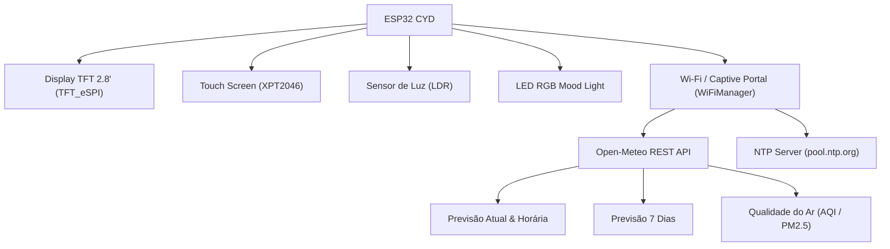

# 🌦️ Atmos BR — Estação Meteorológica para ESP32 CYD

Projeto de código aberto em C++ (PlatformIO) desenvolvido para a placa **ESP32 CYD (*Cheap Yellow Display* / ESP32-2432S028)**, integrando previsão do tempo em tempo real, relógio sincronizado e qualidade do ar em **Português do Brasil**.

---

## 🧭 Mapa de Navegação

* **[[docs/log|Histórico Cronológico & Registro de Alterações (Log)]]**
* **Guia de Instalação e Compilação:** Consulte o arquivo `README.md` na raiz do projeto.

---

## 🛠️ Arquitetura do Sistema

---

## 📱 Telas da Aplicação

1. **Tela 1 — Clima Atual & Relógio:** Hora sincronizada NTP, temperatura atual, sensação térmica, mín/máx, vento, umidade, pressão e qualidade do ar.
2. **Tela 2 — Previsão Horária:** Detalhamento hora a hora das próximas 12 horas com probabilidade de chuva.
3. **Tela 3 — Previsão Semanal (7 Dias):** Temperaturas máximas/mínimas e condições para a semana toda com dias em PT-BR (DOM a SÁB).
4. **Tela 4 — Qualidade do Ar & Dicas:** Índices AQI Europeu, PM2.5, PM10, Ozônio e alertas climáticos (UV, rajadas de vento, geada).
5. **Tela 5 — Informações & Ajustes:** Endereço IP na rede, cidade configurada, seletor de tema visual (toque para trocar), indicador de dado desatualizado e versão do firmware.

---

## 🎨 Temas Visuais

O display suporta múltiplos temas, selecionáveis via portal web ou toque na tela de Settings (persistido na NVS):

* **Swiss Minimalist (Dieter Rams):** Tipografia limpa, grade hairline, acento âmbar — tema padrão.
* **Pixel Art (Retro):** Gradiente de céu, sprites 16x16 de clima (sol/lua/nuvem/chuva/tempestade), paleta âmbar/creme/navy.

Mockups de referência visual (12 conceitos adicionais explorados) ficam em `estilos/` — não versionados no git (ver `.gitignore`), mantidos apenas como material de design local.

---

## 🔒 Segurança

* O portal web de configuração exige autenticação HTTP Basic (usuário/senha definidos em `include/Config.h` como `PORTAL_AUTH_USER`/`PORTAL_AUTH_PASS`) — **troque os valores padrão** antes de expor o dispositivo em rede compartilhada.
* Conexões HTTPS para a API Open-Meteo usam `setInsecure()` (sem validação de certificado) — aceitável para dados públicos de clima, mas não usar esse padrão para tráfego sensível.
* Senhas de Wi-Fi memorizadas ficam em NVS (`Preferences`) sem criptografia adicional — mesma exposição física de qualquer roteador doméstico.
