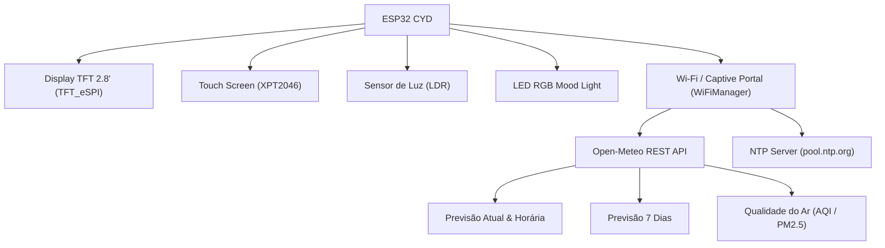

# 🌦️ Atmos BR — Estação Meteorológica para ESP32 CYD

Projeto de código aberto em C++ (PlatformIO) desenvolvido para a placa **ESP32 CYD (*Cheap Yellow Display* / ESP32-2432S028)**, integrando previsão do tempo em tempo real, relógio sincronizado e qualidade do ar em **Português do Brasil**.

---

## 🧭 Mapa de Navegação

* **[[docs/log|Histórico Cronológico & Registro de Alterações (Log)]]**
* **Guia de Instalação e Compilação:** Consulte o arquivo `README.md` na raiz do projeto.

---

## 🛠️ Arquitetura do Sistema

---

## 📱 Telas da Aplicação

1. **Tela 1 — Clima Atual & Relógio:** Hora sincronizada NTP, temperatura atual, sensação térmica, mín/máx, vento, umidade, pressão e qualidade do ar.
2. **Tela 2 — Previsão Horária:** Detalhamento hora a hora das próximas 12 horas com probabilidade de chuva.
3. **Tela 3 — Previsão Semanal (7 Dias):** Temperaturas máximas/mínimas e condições para a semana toda com dias em PT-BR (DOM a SÁB).
4. **Tela 4 — Qualidade do Ar & Dicas:** Índices AQI Europeu, PM2.5, PM10, Ozônio e alertas climáticos (UV, rajadas de vento, geada).
5. **Tela 5 — Informações & Ajustes:** Endereço IP na rede, status de Wi-Fi e modo econômico noturno.
